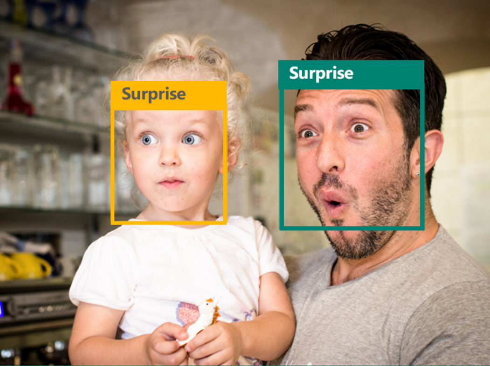
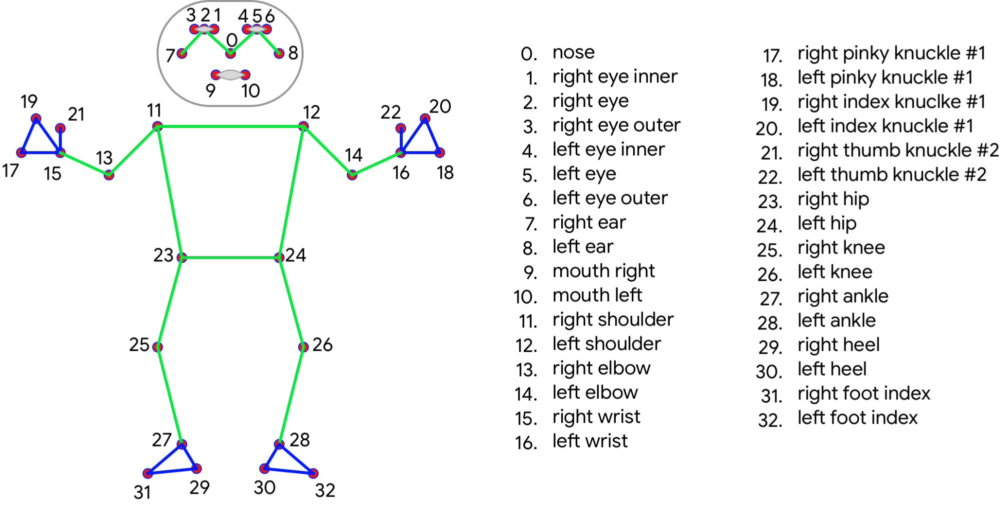

# Real-Time-Body-Language-Decoder


#### Body language are visual languages produced by the movement of the hands, face and body. In this project we evaluate representations based on skeleton poses, as these are explainable, person-independent, privacy-preserving, low-Dimentional representations. Basically skeletal representations generalize over an individual’s appearance and background, allowing us to focus on the recognition of motion. We present a real-time on-device body tracking pipeline that predicts hand skeleton and the whole body notion. It is implemented via MediaPipe, a framework for building cross-platform ML solutions. We perform using pose estimation systems and analyze the applicability of the estimation systems to body language recognition by evaluating failure cases of the existing models. The proposed system and architecture demonstrates real-time inference and high prediction quality.

__________________






# Install Following Dependencies :
```
pip install mediapipe opencv-python scikit-learn pandas
```

# Helful Documentation :
* opencv : https://docs.opencv.org/master/index.html
* mediapipe : https://mediapipe.dev/
* Pandas : https://pandas.pydata.org/
* Scikit-Learn : https://scikit-learn.org/stable/


#  Credits and Video Tutorial ❤️:
* Youtube : https://www.youtube.com/watch?v=We1uB79Ci-w
* Github : https://github.com/nicknochnack
* Thank you very much **Nicholas Renotte** Sir🤝❤️.


# Final Note :
* <h3> Bug fixing, Code error or Anything Raise issue🤚. If it any have.</h3>
* <h3> Happy to hear your sugesstions🤝 about this project.</h3>
* <h3> Feel Free to Give ⭐ to this Repository.</h3>
* <h3> Thank you very much for visiting ❤️.</h3>
* <h3> Stay Safe✌️ and Stay Healthy✌️.</h3>